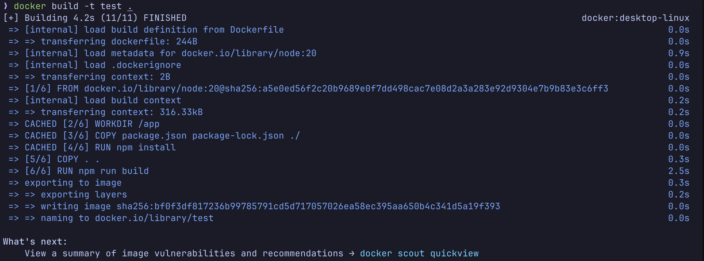
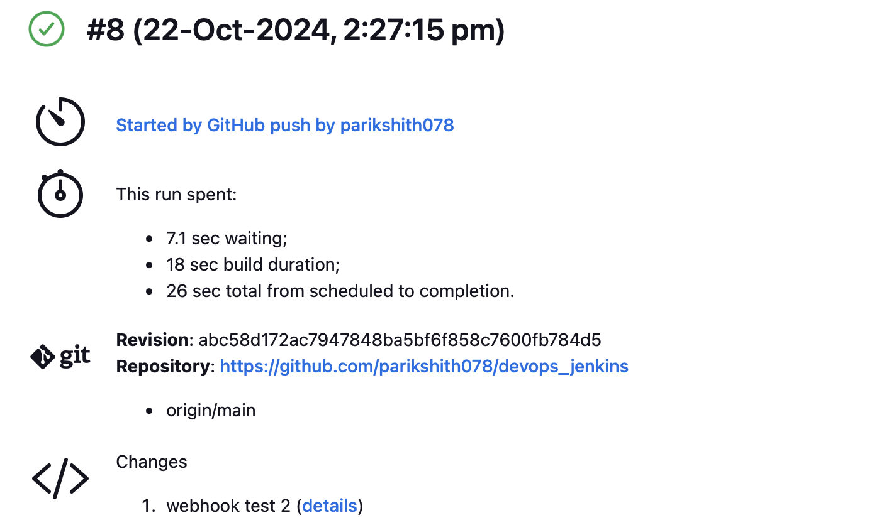
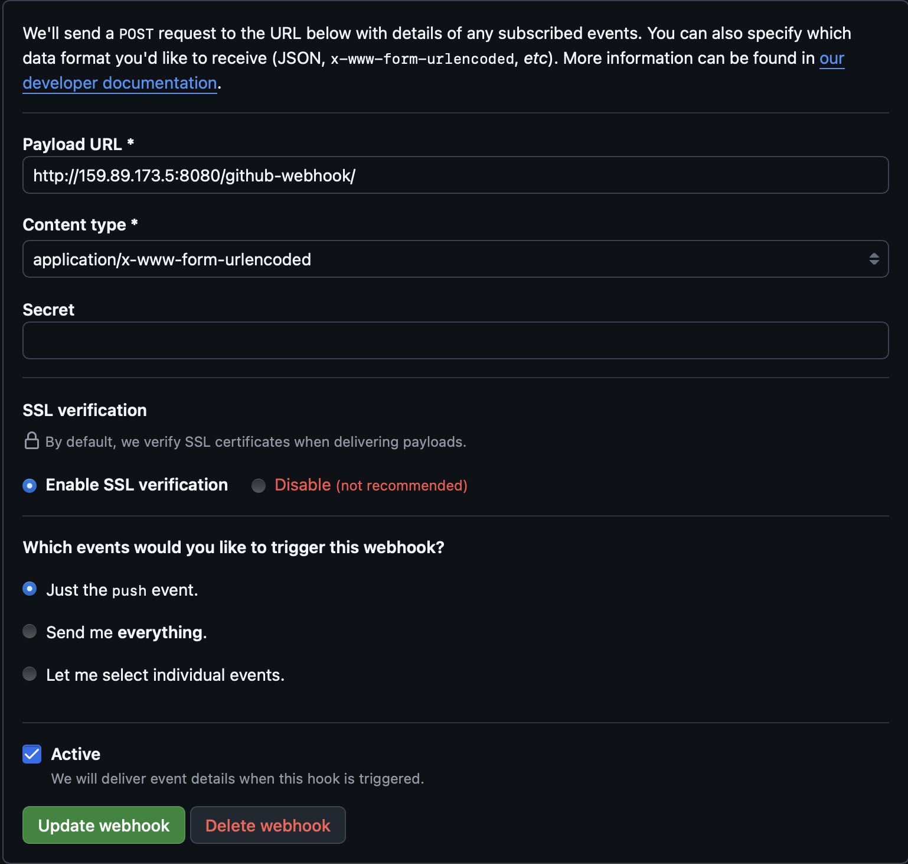

# Building and Running a Node.js Application with Docker

This document outlines the steps to create a Docker container for a Node.js application using a Dockerfile.

## 1. Define the Dockerfile

Create a file named `Dockerfile` in the root directory of your Node.js application and add the following content:

```dockerfile
FROM node:20 AS builder

WORKDIR /app

COPY package.json package-lock.json ./

RUN npm install

COPY . .

RUN npm run build

EXPOSE 4173

CMD ["npm", "run", "preview"]
```

## 2. Build the Docker Image

To build the Docker image, open your terminal and navigate to the directory containing the Dockerfile. Run the following command:

```bash
docker build -t test .
```

### Explanation of the Command

- **docker build**: This command builds a Docker image from the Dockerfile
- **-t test**: This option tags the image with the name "test"
- **.**: This specifies the build context, which is the current directory



## 3. Run the Docker Container

After building the Docker image, you can run the container using the following command:

```bash
docker run -p 4173:4173 test
```

### Explanation of the Command

- **docker run**: This command runs a new container from the specified image
- **-p 4173:4173**: This option maps port 4173 of the container to port 4173 on your host machine, allowing you to access the application from your browser
- **test**: This specifies the image to run


## Accessing the Application

Once the container is running, you can access your Node.js application by navigating to the following URL in your web browser:

`http://localhost:4173`


# CI/CD Setup for Node.js Web Project in Jenkins

## 1. Deploy Jenkins to a Remote Server Using Docker

To deploy Jenkins, run the following command in your terminal:

```bash
docker run -p 8080:8080 -p 50000:50000 -d -v jenkins_home:/var/jenkins_home jenkins/jenkins:lts
```

**Note:** I am using `ufw` to manage firewall. Open port 8080 with this command: `sudo ufw allow 8080/tcp`

## 2. Access the Jenkins UI

Once Jenkins is running, open your web browser and navigate to:
`http://<your-server-ip>:8080`

### Setup Admin Account

Follow the instructions on the setup page to create an admin account.


## 3. Install Node.js & npm

### Option 1: Using Plugins

You can install Node.js and npm using the Jenkins plugins (NodeJS Plugin).

### Option 2: Install Directly Inside the Jenkins Container

For this setup, we will install Node.js directly inside the Jenkins container.

1. Access the Jenkins container using the following command:

```bash
docker exec -u 0 -it <container_id> bash
```

Replace `<container_id>` with your Jenkins container ID.


2. Inside the container, run the following commands to install Node.js and npm:

```bash
apt-get update
apt-get install -y curl
curl -fsSL https://deb.nodesource.com/setup_18.x | bash -
apt-get install -y nodejs npm
```

3. Verify the installation:

```bash
node -v
npm -v
```

## 4. Setup the Job

1. In the Jenkins UI, click on **New Item**
2. Enter a name for your job and select **Freestyle project**
3. Click **OK** to create the job

## 5. Setup the Git Source

1. In the job configuration page, scroll down to the **Source Code Management** section
2. Select **Git**
3. Enter the repository URL of your public GitHub repository where your source files are located:

```
https://github.com/parikshith078/devops_jenkins
```


## 6. Build and Test Script

1. Scroll down to the **Build** section
2. Click on **Add build step** and select **Execute shell**
3. Enter the following build and test script:

```bash
npm install
npm run test
npm run build
```




## 7. Setup a Webhook as a Trigger to Run the Job

### Steps to Create a Webhook in GitHub

1. Go to your GitHub repository
2. Click on the **Settings** tab
3. In the left sidebar, click on **Webhooks**
4. Click the **Add webhook** button
5. In the Payload URL field, enter the following URL:

```
http://<your-jenkins-url>/github-webhook/
```

Replace `<your-jenkins-url>` with your Jenkins server URL. 6. Set Content type to `application/json` 7. Choose the events you want to trigger the webhook. For a simple setup, select **Just the push event** 8. Click **Add webhook**



## Conclusion

Your CI/CD pipeline for the Node.js project is now set up in Jenkins. Every time you push changes to your GitHub repository, the webhook will trigger Jenkins to run the build and test script.
